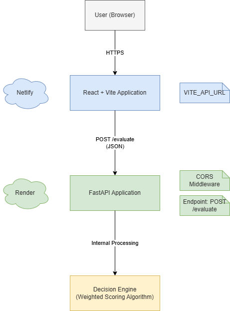

## System Architecture Overview

  

  <em>Figure 1: High-Level Architecture Diagram of BIBILIO</em>

The architecture follows a clean three-tier structure consisting of a Client layer (Browser), a Frontend layer (React + Vite hosted on Netlify), and a Backend layer (FastAPI hosted on Render).  
The backend integrates the decision engine internally to compute weighted rankings based on user-defined criteria.

---

## Level 1 Data Flow Diagram (DFD)

  

  <em>Figure 2: Level 1 Data Flow Diagram Showing Request–Response and Evaluation Flow</em>

This diagram illustrates how user inputs (books, criteria, and weights) flow from the browser to the backend API, where the weighted evaluation logic processes the data and returns ranked results to the user interface.