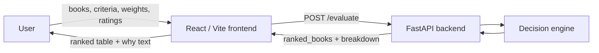
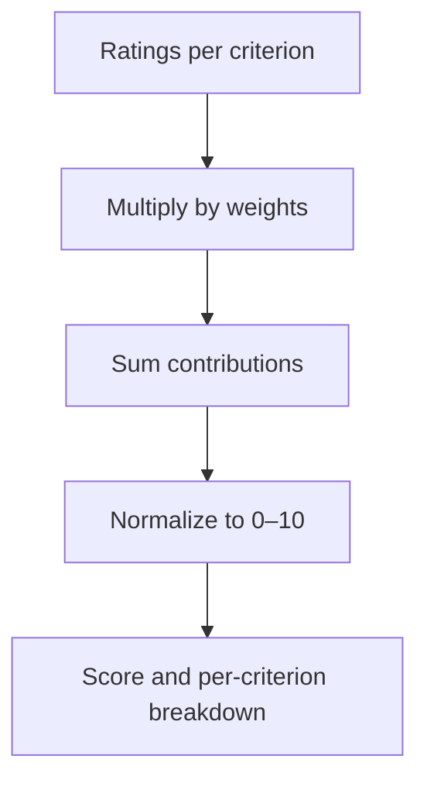

# BIBILIO – Decision Companion

This project is my take on a **“Decision Companion System”**. The concrete problem I picked is:  
_“Which book should I read next, given what matters to me right now?”_

The system is intentionally simple and transparent: it’s a **weighted decision matrix** that I can drive myself. I define the options, I define the criteria, I pick the weights, I rate each option, and the tool simply does the maths and shows me the ranking and the reasoning.

The code lives in a single repo with a small FastAPI backend and a React/Vite frontend.

## My understanding of the problem

For this assignment I assumed the core job is:

- Accept multiple options for a real decision (here: books).
- Let the user define their own criteria and relative importance (weights).
- Collect ratings per option per criterion.
- Compute a score using a clear, explainable formula.
- Return a ranked list **and** explain why the top choice came out on top.

The system must keep working even without any AI model. I treat AI as a helper while building, not as the runtime “brain” of the product.

## What the system does

- Lets me add/remove book options.
- Lets me add/remove/rename criteria and set a weight for each.
- Lets me rate every book on every criterion (0–10).
- Sends this matrix to a FastAPI backend.
- The backend computes a **normalized weighted score (0–10)** for every book and also returns a per‑criterion breakdown.
- The frontend shows:
  - A ranked table of books.
  - A short **“Why this ranking?”** explanation for the top book, based on the breakdown.

## High‑level design

### Project structure

- `backend/`: FastAPI app, Pydantic models, and decision engine.
- `frontend/`: React + Vite SPA (no component libraries, plain CSS).

### Architecture (bird’s eye view)



### Data model and API

`POST /evaluate` request:

```json
{
  "books": [
    {
      "name": "Atomic Habits",
      "ratings": {
        "Readability": 9,
        "Depth": 6,
        "Practicality": 8
      }
    },
    {
      "name": "Deep Work",
      "ratings": {
        "Readability": 7,
        "Depth": 9,
        "Practicality": 7
      }
    }
  ],
  "weights": {
    "Readability": 3,
    "Depth": 8,
    "Practicality": 5
  }
}
```

Response:

```json
{
  "ranked_books": [
    {
      "name": "Deep Work",
      "score": 8.72,
      "breakdown": {
        "Readability": 2.11,
        "Depth": 4.42,
        "Practicality": 2.19
      }
    },
    {
      "name": "Atomic Habits",
      "score": 8.43,
      "breakdown": {
        "Readability": 2.43,
        "Depth": 3.55,
        "Practicality": 2.45
      }
    }
  ]
}
```

The frontend uses `ranked_books` for the main table and the `breakdown` of the top book to explain **why** it is ranked first.

## Decision logic

For each book and each criterion:

- I take the **rating** (0–10) and multiply it by the **weight** for that criterion.
- I sum those weighted contributions to get a raw score.
- I normalize all scores so the final result for each book is in the range **0–10**.

In symbols, for one book:

> raw_score = Σ (rating\[criterion] × weight\[criterion])  
> normalized_score = (raw_score / max_possible) × 10  
> where max_possible = Σ (10 × weight\[criterion])

The backend also exposes the normalized contribution per criterion so the “why” text is just data, not guesswork.

A simple view of the scoring flow:



## Backend (FastAPI)

### Tech

- FastAPI
- Pydantic v2 models
- Uvicorn

### Core pieces

- `models.py`
  - `BookInput`: `name` and `ratings` (dict of criterion → 0–10). Validates rating range.
  - `EvaluationRequest`: list of `BookInput` + `weights` (dict of criterion → positive number). Validates:
    - At least one book and one criterion.
    - Every book has ratings for exactly the same criteria as the weights.
  - `RankedBook`: `name`, `score`, and `breakdown` (criterion → contribution on the 0–10 scale).
  - `EvaluationResponse`: wrapper with `ranked_books`.
- `decision_engine.py`
  - Computes normalized weighted scores and the `breakdown` per criterion.
- `main.py`
  - Defines FastAPI app, CORS, `GET /` health check, and `POST /evaluate`.

### Environment variables (backend)

- **`ALLOWED_ORIGINS`**: comma‑separated list of allowed CORS origins for production, e.g.  
  `ALLOWED_ORIGINS=https://your-netlify-site.netlify.app`

> `.env` files are ignored by `.gitignore`. Don’t commit secrets.

### Run backend locally

From the project root:

```bash
cd backend
python -m venv .venv
.venv\Scripts\activate  # Windows PowerShell
# source .venv/bin/activate  # macOS/Linux

pip install -r requirements.txt
uvicorn main:app --host 0.0.0.0 --port 8000
```

The API will be at `http://localhost:8000`.

## Frontend (React + Vite)

### Tech

- React (JavaScript)
- Vite
- Plain CSS

### What the UI does

- **Hero section** branded as **BIBILIO** with a reading quote to set the tone.
- **Decision tool card** below the hero:
  - Dynamic list of books.
  - Dynamic list of criteria and weights.
  - Rating matrix (books × criteria, 0–10 per cell).
  - Submit button that calls the backend using `VITE_API_URL`.
  - Ranked results table with scores to 2 decimals.
  - A “Why this ranking?” section for the top book using the backend’s `breakdown`.

### Environment variables (frontend)

The frontend reads the backend base URL from `VITE_API_URL`:

- `VITE_API_URL=http://localhost:8000` (local)

Create `frontend/.env`:

```bash
VITE_API_URL=http://localhost:8000
```

### Run frontend locally

From the project root:

```bash
cd frontend
npm install
npm run dev
```

Vite will print the dev URL (often `http://localhost:5173` or `5174`). Make sure `VITE_API_URL` points at the running backend.

### Build for production

From `frontend/`:

```bash
npm run build
```

This creates a `dist/` folder that Netlify (or any static host) can serve.

## Deployment notes

### Backend on Render

1. Push this repo to GitHub.
2. In Render, create a new **Web Service** pointing at the repo.
3. Set the working directory to `backend` (or root with commands adjusted).
4. Build command (if needed): `pip install -r requirements.txt`
5. Start command: `uvicorn main:app --host 0.0.0.0 --port 8000`
6. Set `ALLOWED_ORIGINS` to your Netlify URL.

### Frontend on Netlify

1. In Netlify, create a **New site from Git** using this repo.
2. Base directory: `frontend`
3. Build command: `npm run build`
4. Publish directory: `dist`
5. Set `VITE_API_URL` to your Render backend URL.

## Design decisions and trade‑offs

- **Weighted matrix, no AI at runtime**  
  I wanted the logic to be explainable and simple to check by hand. Everything is just multiplication, addition, and a normalization step.

- **Dynamic criteria and books**  
  I didn’t hard‑code any criteria. This keeps the tool generic enough to reuse for other decisions with almost no backend changes.

- **Backend as the single source of truth for scores**  
  The frontend could in theory recompute the scores, but I kept all scoring in the backend so there’s a single, testable implementation.

- **No database**  
  The assignment doesn’t require persistence. Keeping everything in memory keeps the code and deployment small and easy to reason about.

## Edge cases I considered

- No books or no criteria → backend validation fails with a clear message.
- Ratings outside 0–10 → rejected by Pydantic.
- Weights ≤ 0 → rejected by Pydantic.
- Books missing ratings for some criteria or having extra criteria → rejected and explained per book.
- All ratings at 0 → scores normalize correctly to 0.

## What I’d improve with more time

- Add presets for common decision types (e.g. travel, laptop, courses) while keeping the free‑form mode.
- Add a quick comparison view that highlights the criteria where the top two options differ the most.
- Add a small “scenario” feature: save one decision setup (books + criteria + weights) locally in the browser.
- Add a couple of automated tests around the decision engine and the validation rules.

## Git and monorepo

- Git is initialized at the repo root.
- `.gitignore` skips virtualenvs, `node_modules`, build artefacts, and `.env` files.
- Backend and frontend live side by side to keep deployment simple (Render for the API, Netlify for the UI). A single repo also matches how I’d actually ship a small tool like this.

